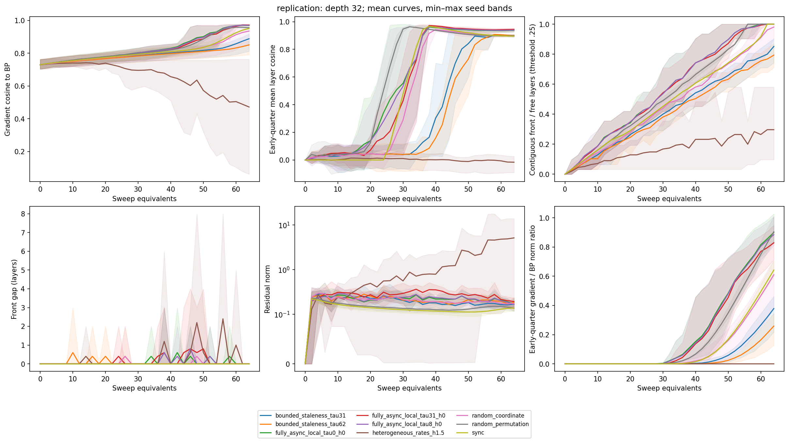
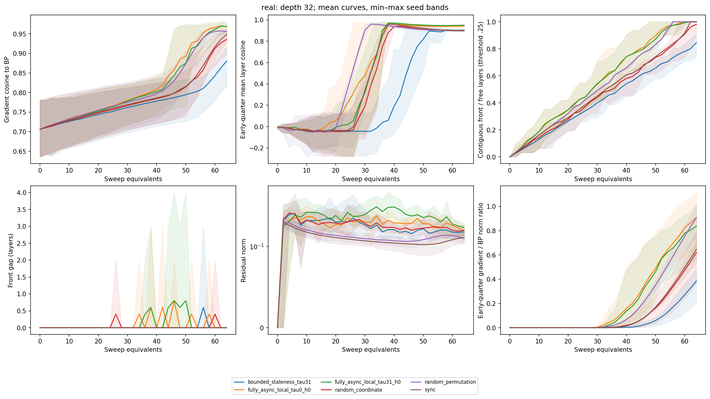

> Public evidence snapshot. Aggregate CSVs, all 111 replicated endpoints, resolved configs and raw-file hashes are included alongside two aggregate figures. Paths under `results/prebeam/` below refer to the preserved local raw experiment archive, not files shipped in this commit.





# Pre-BEAM PC-ALM experimental record

**Status: COMPLETE. Verdict: GO — a bounded actor experiment is scientifically justified.** All planned validation, synthetic replication, depth checks, Fashion-MNIST replication, and integrity checks are complete.

## Question

Does useful PC-ALM credit propagation survive sequential activity updates, delayed neighbor activities, and removal of the global dual-update barrier at equal local-update work? This is fixed-weight inference at initialization, not a training or Python-versus-BEAM performance benchmark.

## Recovery and validation

Recovered interrupted session `01a0a17a-2497-7d62-84b9-db18aa259804`. Original commit: `660747f`; supplied overlay commit: `2620450`. The earlier session completed the precision-corrected scout and the 256-step synchronous-reference check. Its extended scout had not completed. See [RECOVERY.md](RECOVERY.md).

Fresh initial suite: **38 passed**. Final complete suite after the analysis correction: **39 passed in 56.90 seconds**, including all 15 original tests; see [final test log](tests-final.log). Compileall and two fresh smoke runs passed. Schedules/fronts/layer/gradient CSVs are identical across the repeats; the maximum trace difference is 2.98e-8 in a state-distance reduction. See [validation.txt](validation.txt), [repeat QC](repeat_qc.txt), and [recovered validation/profile evidence](recovered_validation_evidence.txt).

All original computational source, calibration files, lockfile and Python pin match the baseline. The only original path changed at the end is `.gitignore`, through the external commit described below. The official synchronous oracle supplies every sync trajectory. Full-block equivalence at depth 32 had maximum activity/dual difference 1.67e-6. At highest matmul precision, the recovered 62-event compiled/eager check matched exactly; the regression suite also tests every checkpoint across the async modes.

## Corrections and final semantics

- Common gradient diagnostics now use actual post-update duals for all modes. Published pre-dual sync credit remains a separate trace field.
- Compiled events and compiled diagnostics remove repeated eager autodifferentiation overhead; eager execution remains available for regression tests.
- Highest GPU matmul precision corrects a depth-32 fused/eager discrepancy of about 1e-4 at default precision. Earlier default-precision outputs are retained outside this report and excluded from comparative findings.
- Delay RNG and layer-selection RNG are independent. Uniform coordinate, stale, and fully local modes have identical selections for each paired scheduler seed.
- Balanced shuffled and input-to-output/output-to-input ordered sweeps distinguish sequential ordering from repeated/missed layer updates.
- Layer gradient magnitudes supplement cosines. Study calibration is read directly from repository CSV tables.
- The raw-analysis helper now matches exact mode labels: substring matching could confuse h0 with h0.5. A regression test covers rate and seed prefixes; this correction changes QC lookup, not inference trajectories. Aggregation preserves distinct delay/rate settings.

One sync sweep costs L_free layer updates. All study cells use inner_steps=1, alpha=rho=1, width 32 and ReLU. Both global and local modes consume the same total dual-update work. Fully local updates use the current owned activity and immediately advance its owned dual; only neighbor activities can be stale. Neighbor dual reads remain current. All modes use the same unchanged augmented-Lagrangian equations.

## Measurement validity

The raw depth-32 sync trace at two sweeps has nonzero duals only at output distances 0 and 1 (norms 0.42155 and 0.09628); distances 2–5 are zero. The fixed .25 front advances to half the free layers at 34 sweeps and 90% at 60 sweeps. It is not initially saturated.

Reference norms at seed 0 range from 0.9570 to 1.9294. No effectively zero reference layer passed QC. However, 128 steps is a finite-time scale, not a converged solution: doubling to 256 changes individual norms by 4–40%. At threshold .25, sync arrival times at 25/50/75/90% depth change from 18/34/52/60 to 16/32/50/60 sweeps. Fully local delay-one-sweep t90 stays 52; global delay-two-sweeps still does not reach 90%. Higher thresholds are more reference-sensitive. All four original thresholds (.10,.25,.50,.75) are retained; no epsilon or threshold retuning was used. See [reference sensitivity](reference_sensitivity.csv).

First passages are first observed crossings at checkpoint resolution and can precede a later front retreat. Unreached targets are censored, not assigned the terminal work budget. No power-law exponent is claimed: finite-depth saturation, retreat, threshold sensitivity and insufficient independent depth evidence make that premature.

## Synthetic depth-32 paired results

Seeds 0–4 jointly determine initialization and batch; scheduler seed = 101 + 1009*seed. Work = 64 sweeps = 1,984 activity updates; reference = 128 steps; state_lr = 0.234285. Reported spreads are sample SD, not standard error. Early means the input-side quarter of weight layers.

| Mode | n | BP cosine, mean ± SD | Early cosine | Early gradient/BP norm | Final R (.25) | t90 reached / n; median | Residual norm |
|---|---:|---:|---:|---:|---:|---:|---:|
| bounded_staleness_tau31 | 5 | 0.8884 ± 0.0439 | 0.8967 | 0.379 | 26.4/31 | 2/5; 64 | 0.167 |
| bounded_staleness_tau62 | 5 | 0.8509 ± 0.0348 | 0.9003 | 0.259 | 24.6/31 | 0/5; — | 0.184 |
| fully_async_local_tau0_h0 | 5 | 0.9696 ± 0.0013 | 0.9377 | 0.900 | 31.0/31 | 5/5; 52 | 0.166 |
| fully_async_local_tau31_h0 | 5 | 0.9724 ± 0.0040 | 0.9446 | 0.829 | 31.0/31 | 5/5; 52 | 0.192 |
| fully_async_local_tau8_h0 | 5 | 0.9707 ± 0.0015 | 0.9395 | 0.885 | 31.0/31 | 5/5; 52 | 0.166 |
| heterogeneous_rates_h1.5 | 5 | 0.4719 ± 0.3339 | -0.0159 | 0.000 | 9.2/31 | 0/5; — | 5.103 |
| random_coordinate | 5 | 0.9356 ± 0.0418 | 0.8959 | 0.610 | 30.4/31 | 5/5; 58 | 0.175 |
| random_permutation | 5 | 0.9561 ± 0.0059 | 0.8993 | 0.905 | 31.0/31 | 5/5; 54 | 0.137 |
| sync | 5 | 0.9516 ± 0.0035 | 0.8956 | 0.642 | 31.0/31 | 5/5; 60 | 0.138 |

The fully local one-sweep-delay mode exceeds sync overall alignment in all five pairs (differences +0.0120 to +0.0261) and early-layer alignment in all five (+0.0332 to +0.0649). This credit has substantial magnitude: the mean early gradient norm is 0.829 times BP. Its median t90 is 52 sweeps, versus sync 60, with every seed reaching the target.

Balanced sequential updates retain near-sync overall alignment. Coordinate sampling is more variable: one seed falls to 0.861 while its balanced control reaches 0.947. Fully local and coordinate runs share the selected-layer sequence, so the fully local behavior is not explained by more activity work or a favorable resampling of layers.

With global dual updates, one- and two-sweep activity delays reduce overall alignment in every pair. Early directional cosines alone obscure this loss: early gradient/BP magnitude ratios fall to 0.379 and 0.259. Strong rate heterogeneity fails to deliver meaningful early credit and can produce large residuals while staying numerically finite. It is substantially confounded by layer starvation; it is not the affirmative basis for an actor experiment.

## Experiment matrix and reproducibility

All paired comparisons use the same initialization and batch within a cell. The experiment seed is 0–4 for the primary synthetic and Fashion-MNIST replications, and 0–2 at depths 16 and 64. Scheduler seeds are 101, 1110, 2119, 3128 and 4137. Input dimension is 128 for synthetic data and 784 for Fashion-MNIST; output dimension is 10, width 32, batch size 32, activation ReLU, alpha=rho=1, inner_steps=1. Native dataset preprocessing is unchanged. Each real cell uses the first deterministic batch from a native-loader balanced subset of 256 training examples; weights never train.

| Stage | Seeds | Depth | Work sweeps / layer updates | Reference steps | State learning rate | Modes |
|---|---|---:|---:|---:|---:|---|
| Supplied scout | 0 | 32 | 64 / 1,984 | 128 | 0.234285 | 10 supplied modes: sync, coordinate, blocks 4/8, rates .5/1.5, delays 1/4/8 events, fully local delay4/rate1 |
| Extended scout | 0 | 32 | 64 / 1,984 | 128 | 0.234285 | 14: sync, shuffled/forward/reverse sweeps, block24; global-dual delays 0/8/16/31/62; fully local delays 0/8/31 at uniform rates, and delay8/rate.5 |
| Main replication | 0–4 | 32 | 64 / 1,984 | 128 | 0.234285 | 9 modes in the table above |
| Depth check | 0–2 | 16 | 32 / 480 | 64 | 0.221921 | sync, coordinate, shuffled, global delay1 sweep, fully local delay0/1 sweep |
| Depth check | 0–2 | 64 | 128 / 8,064 | 256 | 0.242954 | same six normalized comparisons |
| Fashion-MNIST | 0–4 | 32 | 64 / 1,984 | 128 | 0.23588549900873967 | same six normalized comparisons |
| Reference sensitivity | 0 | 32 | 64 / 1,984 | 256 | 0.234285 | official sync, used to renormalize saved scout trajectories |

Two depth-6 tanh smoke cells additionally use the supplied smoke config (six modes each). There are **21 completed cells / 148 mode runs** in this record: **111 replicated scientific trajectories**, 24 scout trajectories, 12 smoke trajectories, and one reference-sensitivity control. Overlapping seed-0 scout/replication results are not counted as additional independent seeds.

Delay labels in filenames are event counts. One-sweep delay means tau=15/31/63 at depths 16/32/64; depth-32 tau=8 is 0.258 sweep, tau=16 is 0.516, and tau=62 is 2 sweeps. These are maximum uniformly sampled delays; mean requested delay is about half the bound. Early history is clipped, owned activities stay current, and neighbor duals stay current. Every raw event records the actual history version. Global and local dual work totals match activity work for these inner_steps=1 cells.

[experiment_inventory.csv](experiment_inventory.csv) lists every cell/mode and all numerical settings and seeds. Each cell contains input/resolved configuration, source hashes, summary, and all five raw trace CSVs. [source_snapshot/manifest.json](source_snapshot/manifest.json) hashes the overlay, support files and calibration snapshots. Numerical source hashes in every completed run match the final files. Reproduction uses the recorded Python/GPU environment in [environment.json](environment.json); no environment changes were made during this continuation.

## Depth validation

These are three-seed descriptive checks at each additional depth. Delays below are normalized to sweeps. The front column gives reached count and median first observed t90 at threshold .25.

| Depth | Mode | n | BP cosine ± SD | Early cosine | t90 reached; median sweeps |
|---:|---|---:|---:|---:|---:|
| 16 | Global duals, delay ≤1 sweep | 3 | 0.9111 ± 0.0374 | 0.9183 | 1/3; 29 |
| 16 | Fully local, no delay | 3 | 0.9725 ± 0.0054 | 0.9488 | 3/3; 22 |
| 16 | Fully local, delay ≤1 sweep | 3 | 0.9687 ± 0.0103 | 0.9509 | 3/3; 25 |
| 16 | Coordinate | 3 | 0.9392 ± 0.0083 | 0.9220 | 3/3; 32 |
| 16 | Balanced shuffled | 3 | 0.9642 ± 0.0023 | 0.9247 | 3/3; 27 |
| 16 | Sync | 3 | 0.9561 ± 0.0053 | 0.9213 | 3/3; 30 |
| 64 | Global duals, delay ≤1 sweep | 3 | 0.8988 ± 0.0182 | 0.8966 | 0/3; — |
| 64 | Fully local, no delay | 3 | 0.9687 ± 0.0071 | 0.9353 | 3/3; 100 |
| 64 | Fully local, delay ≤1 sweep | 3 | 0.9734 ± 0.0053 | 0.9418 | 3/3; 100 |
| 64 | Coordinate | 3 | 0.9566 ± 0.0067 | 0.8930 | 3/3; 120 |
| 64 | Balanced shuffled | 3 | 0.9532 ± 0.0095 | 0.8995 | 3/3; 108 |
| 64 | Sync | 3 | 0.9554 ± 0.0058 | 0.8935 | 3/3; 120 |

At depth 64, the fully local one-sweep-delay mode retains high alignment in all three seeds and reaches 90% depth with median 100 sweeps, versus sync 120. At depth 16, it retains near-sync or better overall alignment and improves early-layer alignment in all three pairs; its overall difference in one seed is −0.00027. Thus the result is retention with a structured timing difference, not universal superiority at every depth and endpoint. L=128 and an MNIST follow-up were not run: the replicated L=16/32/64 and Fashion-MNIST evidence suffices for this initial actor gate, without claiming behavior beyond that range.

## Fashion-MNIST fixed-weight validation

| Mode | n | BP cosine ± SD | Early cosine | Early gradient/BP norm | Final R (.25) | t90 reached; median | Residual norm |
|---|---:|---:|---:|---:|---:|---:|---:|
| Global duals, delay ≤1 sweep | 5 | 0.8803 ± 0.0424 | 0.8985 | 0.385 | 26.2/31 | 2/5; 64 | 0.158 |
| Fully local, no delay | 5 | 0.9688 ± 0.0079 | 0.9431 | 0.908 | 31.0/31 | 5/5; 52 | 0.158 |
| Fully local, delay ≤1 sweep | 5 | 0.9689 ± 0.0132 | 0.9490 | 0.838 | 31.0/31 | 5/5; 52 | 0.181 |
| Coordinate | 5 | 0.9359 ± 0.0267 | 0.8999 | 0.619 | 30.4/31 | 5/5; 58 | 0.165 |
| Balanced shuffled | 5 | 0.9558 ± 0.0054 | 0.9044 | 0.908 | 31.0/31 | 5/5; 54 | 0.129 |
| Sync | 5 | 0.9477 ± 0.0124 | 0.8993 | 0.646 | 31.0/31 | 5/5; 60 | 0.131 |

Fully local delay-one-sweep improves total cosine in all five real-data pairs (deltas +0.0142 to +0.0274) and early cosine in all five (+0.0324 to +0.0604). The smallest terminal cosine of any individual weight layer across those five runs is 0.9094; see [layerwise audit](layerwise_final_audit.json). This is not a cosine-of-negligible-credit result: the average early gradient/BP norm ratio is 0.838. Median t90 is 52 sweeps versus sync 60, and all seeds reach it. No training, test-accuracy improvement, or reuse of the old Fashion-MNIST training run is claimed.

## Stability, constraints and difference from sync

Every recorded mode completed its requested work and passed finite-state, serialization, accounting, staleness-bound and configuration-coverage checks. Per-event finite/magnitude checks ran inside the simulator; no divergence guard fired. The maximum-state statistic below is the **maximum at saved checkpoints**, not a separately retained per-event peak. Constraint residuals and dual norms are saved per layer, and terminal state/dual differences are measured against the official same-work control.

| Synthetic depth-32 mode | Mean state L2 from sync | Mean dual L2 from sync | Maximum checkpoint state magnitude | Maximum front gap (.25) |
|---|---:|---:|---:|---:|
| bounded_staleness_tau31 | 0.4543 | 0.9772 | 4.905 | 0 |
| bounded_staleness_tau62 | 0.6565 | 1.3657 | 4.905 | 3 |
| fully_async_local_tau0_h0 | 0.5605 | 1.0850 | 4.905 | 3 |
| fully_async_local_tau31_h0 | 0.8081 | 1.0170 | 4.907 | 4 |
| fully_async_local_tau8_h0 | 0.6104 | 1.0544 | 4.905 | 3 |
| heterogeneous_rates_h1.5 | 6.7803 | 30.2941 | 11.492 | 8 |
| random_coordinate | 0.2163 | 0.5693 | 4.905 | 2 |
| random_permutation | 0.3511 | 0.9371 | 4.905 | 0 |
| sync | 0.0000 | 0.0000 | 4.905 | 0 |

Numerical state distance is not the success criterion: the fully local delayed state is farther from sync than the coordinate state but carries stronger useful credit. Fully local fronts can have transient gaps (up to four layers in the main synthetic and real-data replications), so propagation is not an exactly compact front. Strong rate heterogeneity has endpoint residuals ranging from 0.117 to 13.794, virtually no useful early-layer gradient, and selected-layer counts as skewed as 1 versus 622 updates. That is a failure of credit delivery despite status `ok`; it is not evidence that every finite trajectory is useful.

## Threshold sensitivity and limitations

The main seed aggregation below exposes the 90%-depth reach count at every original threshold. Entries are reached seeds / 5 and, if reached, the conditional median sweep count. A conditional median with censoring is not an unconditional arrival estimate.

| Mode | Threshold .10 | Threshold .25 | Threshold .50 | Threshold .75 |
|---|---:|---:|---:|---:|
| bounded_staleness_tau31 | 5/5; 58 | 2/5; 64 | 0/5; — | 0/5; — |
| bounded_staleness_tau62 | 4/5; 62 | 0/5; — | 0/5; — | 0/5; — |
| fully_async_local_tau31_h0 | 5/5; 46 | 5/5; 52 | 0/5; — | 0/5; — |
| random_permutation | 5/5; 48 | 5/5; 54 | 3/5; 62 | 0/5; — |
| sync | 5/5; 54 | 5/5; 60 | 0/5; — | 0/5; — |

The .10 and .25 fronts agree on the qualitative timing advantage. The higher thresholds do not resolve complete propagation reliably within this budget, and the reference is not converged. Hence no near-ballistic exponent, asymptotic convergence claim, universal sharp delay threshold, or general scaling law is established. The fully local tolerance shown here is through **one maximum sweep of activity delay**, not arbitrary delays. The two-sweep delay replication concerns global-dual semantics only.

Other limits: width 32, ReLU, fixed random initial weights, batches of 32, and five paired seeds for the primary comparisons. Layer scheduling and both neighbor activity reads use a centralized event/history simulator; stale snapshots correlate the neighbor reads. Neighbor duals remain current, messages cannot be independently reordered/lost, and no true simultaneous actors or backpressure were exercised. Alpha=1 local updates with inner_steps=1 do not establish the behavior of other dual/work ratios. Training usefulness and BEAM throughput remain untested.

## Runtime and implementation behavior

| Recorded stage | Completed cells | Mode runs | Sum of cell runtime, seconds |
|---|---:|---:|---:|
| depth | 6 | 36 | 1042.6 |
| real | 5 | 30 | 458.5 |
| reference256 | 1 | 1 | 50.7 |
| replication | 5 | 45 | 702.2 |
| scout | 1 | 14 | 237.4 |
| smoke | 1 | 6 | 7.9 |
| smoke_repeat | 1 | 6 | 7.9 |
| supplied_scout | 1 | 10 | 175.1 |

These are harness wall times, including compilation and diagnostics, not isolated kernel timings. Summed cell times are not elapsed study time: resumed depth-64 and Fashion-MNIST stages overlapped on this 24-CPU / 16-GB GPU workstation, as did final verification. The preserved interrupted depth-64 attempt last logged a completed mode at 159.7 seconds before its incomplete cell was restarted. Earlier default-precision exploratory runs and environment bring-up are outside this table. [runtime.json](runtime.json) and per-stage logs preserve the measurements.

The recovered eager depth-32 profile took 28.3 seconds for just two coordinate sweeps, with 19.8 seconds inside repeated gradient evaluation. A highest-precision 62-event equivalence check took 24.0 seconds eager versus 1.8 compiled and matched exactly. Compiling events makes the scientific study practical, but each event still computes a full free-state gradient, dispatches from Python, retains a Python history, and synchronizes a scalar magnitude to the host. GPU utilization samples were low (roughly 1–13% before overlapping stages). This remains dominated by simulator/dispatch/compilation overhead at these sizes; there is no Python-versus-BEAM performance result.

## Plots and raw evidence

- [Five-seed synthetic trajectories](replication/depth32_aggregate.png): overall/early alignment, early gradient magnitude, front, gap and residual, with seed min–max bands.
- [Five-seed Fashion-MNIST trajectories](real/depth32_aggregate.png).
- [Depth-16 aggregate](depth/depth16_aggregate.png) and [depth-64 aggregate](depth/depth64_aggregate.png).
- [Supplied scout](supplied_scout/dynamics.png) and [extended delay/order scout](scout/depth32_seed0/dynamics.png).
- [Official sync dual-growth heatmap](supplied_scout/sync_dual_growth.png); output distance 0 is output-adjacent.
- Full endpoint/arrival/constraint statistics: [synthetic aggregate](replication/aggregate.csv), [depth aggregate](depth/aggregate.csv), [real aggregate](real/aggregate.csv). Every cell also has analysis.json and all raw CSVs.
- [Final raw-output QC log](analysis-final.log), [reference-budget sensitivity](reference_sensitivity.csv), [inventory](experiment_inventory.csv).

## Verdict and exact reason

**GO.** A subsequent bounded actor realization has a concrete scientific question to test. Useful early credit survives balanced sequential scheduling and fully local dual updates at equal activity and total dual work. Fully local activity-delay tolerance and earlier low-threshold credit arrival reproduce across five synthetic seeds, five Fashion-MNIST seeds, and calibrated depth checks. Global-dual stale updates show a different reproducible quality loss on the same layer-selection sequences. These effects survive work normalization and are not reduced to the starvation explanation for strong rate heterogeneity.

This verdict justifies an actor **semantics experiment**. It does not demonstrate that BEAM is the best numerical backend, that actors will be faster, or that the fixed-weight alignment improvements improve training. The reference-normalization limitation narrows the propagation claim but does not erase the independently measured, substantial BP-aligned local credit.

## What the subsequent BEAM experiment must test

1. First replay recorded event orders and versions with per-layer owned activity/dual state and verify numerical agreement with this simulator on the same model/batch. Preserve the original equations and work accounting.
2. Then use independently scheduled processes and actual neighbor messages, including **stale dual messages** and independently aged activity neighbors. Measure both activity and dual message versions/ages, update-count imbalance, and queue/backpressure behavior. No hidden global dual barrier or current-global-dual read may substitute for messaging.
3. Re-run sync-matched fixed-weight comparisons at normalized delay bounds 0, about .25 and 1 sweep, with five paired synthetic/Fashion-MNIST seeds. Retention of early gradient direction **and magnitude**, arrival curves and finite bounded state are the gates. Count activity and dual work separately; record actual realized delay distributions.
4. If that idealization gap destroys useful credit, revise or reject the actor realization before any training-scale or throughput project. If it survives, only then investigate physical execution efficiency.

No Elixir, BEAM, GenServer, Akka, cluster, or training implementation was created in this task.

## Repository integrity and reproduction commands

Final `git status --short`, `git diff --stat`, and `git diff` are empty. During the run, commit `c1fef45815c645c17376c1fc0ee4904ebee4172d` appeared in the shared checkout and recorded the experimental changes. **This assistant issued no commit command.** It also added `tmp/` to `.gitignore`; that is the sole changed path among the 26 original baseline files. All original computational source/configuration remains byte-identical. See [integrity.json](integrity.json), [changes from the supplied overlay](changes-from-supplied-overlay.diff), and [final status](final-git-status.txt).

The nine originally supplied overlay paths are listed in OVERLAY_MANIFEST.md. Modified supplied paths are ASYNC_EXPERIMENT.md, the two async modules, the dynamics runner, and the two async test files. Added support is configs/async_gate.yaml; scripts/analyze_async_dynamics.py, run_async_study.py, summarize_async_study.py, analyze_prebeam.py; and tests/test_async_analysis.py. Results, datasets, environment and caches remain ignored; the old paper-source tmp/ directory is now ignored by the external commit. Existing results/repro_fashion_n32_l32 and the native datasets were preserved. No driver, system CUDA, Python installation, or working GPU environment was altered.

From the repository root, reproduce into a **new** root to preserve this record:

```bash
XLA_PYTHON_CLIENT_PREALLOCATE=false uv run --no-sync --python 3.12 pytest -q
XLA_PYTHON_CLIENT_PREALLOCATE=false uv run --no-sync --python 3.12 python scripts/run_async_study.py --stage scout --output-root results/prebeam_reproduction
XLA_PYTHON_CLIENT_PREALLOCATE=false uv run --no-sync --python 3.12 python scripts/run_async_study.py --stage replication --seeds 0,1,2,3,4 --output-root results/prebeam_reproduction
XLA_PYTHON_CLIENT_PREALLOCATE=false uv run --no-sync --python 3.12 python scripts/run_async_study.py --stage depth --depths 16,64 --seeds 0,1,2 --output-root results/prebeam_reproduction
XLA_PYTHON_CLIENT_PREALLOCATE=false uv run --no-sync --python 3.12 python scripts/run_async_study.py --stage real --seeds 0,1,2,3,4 --output-root results/prebeam_reproduction
```

Run stages individually after checking the preceding results. The exact smoke, supplied-scout and reference configurations are in their recorded directories; use `run_async_dynamics.py --config <recorded-config> --output-dir <new-directory>` for those cells. Rebuild this record's derived analysis with:

```bash
XLA_PYTHON_CLIENT_PREALLOCATE=false uv run --no-sync --python 3.12 python scripts/analyze_prebeam.py results/prebeam
```

**Remaining authorized work: none.** The subsequent actor experiment is the next proposed scientific task, not an unfinished implementation from this one.
